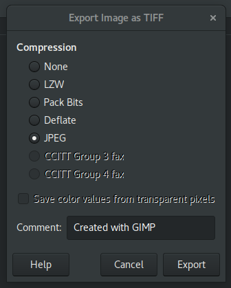
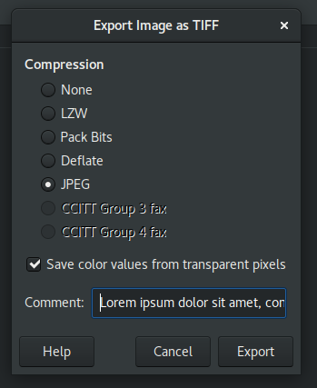
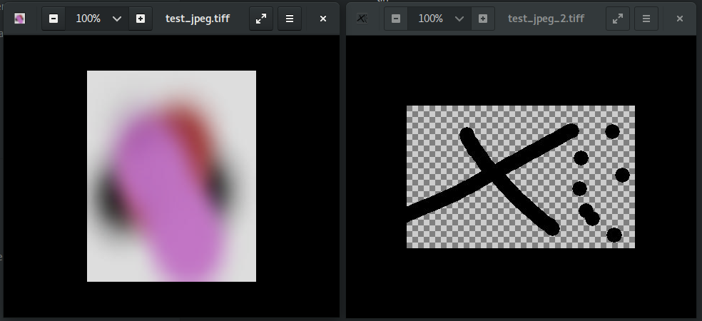

# Images

There are two images, [test_jpeg.tiff](./src/biz/karms/test/jpegtiff/test_jpeg.tiff), that has no transparency,
and was exported from GIMP as:



and [test_jpeg_2.tiff](./src/biz/karms/test/jpegtiff/test_jpeg_2.tiff), that has a transparency and was exported from GIMP as:



GNOME Files preview, GIMP 2.8.22 as well as Eye Of Gnome (eog 3.28.4) can read these TIFF
containers and decode the JPEG compressed raster. This is what it is supposed to look like (yes, the blur is expected):



# Problem

JDK used to throw `Unsupported Image Type` exception on decoding both of these. That was acceptable, although apparently suboptimal.
Current latest early-access, apparently with [JDK-8274735](https://bugs.openjdk.java.net/browse/JDK-8274735) fixed, see [jdk/pull/7849](https://github.com/openjdk/jdk/pull/7849),
does not throw `Unsupported Image Type` exception anymore, seemingly correctly processing the image, although the output
is wrong. See (empty transparent) [./doc/test_jpeg.tiff-fail.png](./doc/test_jpeg.tiff-fail.png).

## Expected output

Either `Unsupported Image Type` exception or a valid image.

# Reproducer

```
$ javac src/biz/karms/test/jpegtiff/Main.java
$ java -cp src biz.karms.test.jpegtiff.Main
```

## Results

These fails on `Unsupported Image Type` are what I expected, thinking that JPEG compression
within TIFF container is not supported:

* OpenJDK Runtime Environment Temurin-11.0.14+9 (build 11.0.14+9)
```
test_jpeg.tiff: Unsupported Image Type
test_jpeg_2.tiff: Unsupported Image Type
```

* OpenJDK Runtime Environment Temurin-17.0.3+7 (build 17.0.3+7)
```
test_jpeg.tiff: Unsupported Image Type
test_jpeg_2.tiff: Unsupported Image Type
```

This is an unexpetced behaviour though. The `test_jpeg.tiff` is read and processed into `test_jpeg.tiff.png`,
although the content is incorrect.

* OpenJDK Runtime Environment (build 17.0.4-internal+0-adhoc.karm.jdk17u) (jdk-17.0.4+2)

```
test_jpeg.tiff: test_jpeg.tiff.png
test_jpeg_2.tiff: Unsupported Image Type
```

EOM
