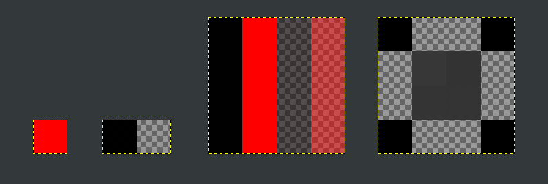
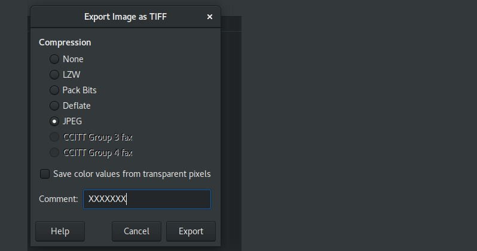
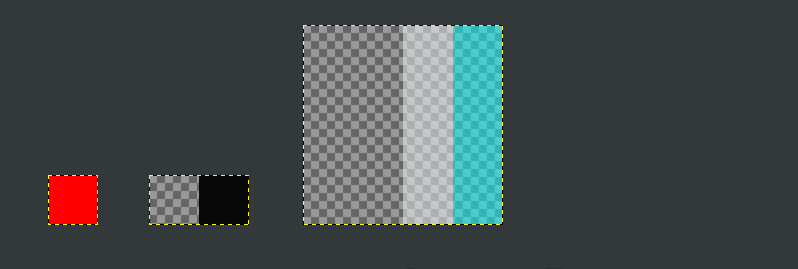

# Images

There are four .tiff images:

1. [test_1x1_jpeg.tiff](./src/biz/karms/test/jpegtiff/test_1x1_jpeg.tiff): single red pixel, JPEG compressed.
2. [test_2x1_jpeg.tiff](./src/biz/karms/test/jpegtiff/test_2x1_jpeg.tiff): one black pixel, one fully transparent pixel, JPEG compressed.
3. [test_4x4_jpeg.tiff](./src/biz/karms/test/jpegtiff/test_4x4_jpeg.tiff): black column, red column, black column 50% transparency, red column 50% transparency.
4. [test_4x4_jpeg_grayscale.tiff](./src/biz/karms/test/jpegtiff/test_4x4_jpeg_grayscale.tiff): pattern of black and gray and fully transparent pixels.



### Tiffinfo

```
$ find src -name "*.tiff" | xargs tiffinfo

src/biz/karms/test/jpegtiff/test_1x1_jpeg.tiff:
TIFF Directory at offset 0x34 (52)
  Subfile Type: (0 = 0x0)
  Image Width: 1 Image Length: 1
  Resolution: 72, 72 pixels/inch
  Bits/Sample: 8
  Compression Scheme: JPEG
  Photometric Interpretation: RGB color
  Orientation: row 0 top, col 0 lhs
  Samples/Pixel: 3
  Rows/Strip: 64
  Planar Configuration: single image plane
  JPEG Tables: (289 bytes)

src/biz/karms/test/jpegtiff/test_2x1_jpeg.tiff:
TIFF Directory at offset 0x4a (74)
  Subfile Type: (0 = 0x0)
  Image Width: 2 Image Length: 1
  Resolution: 72, 72 pixels/inch
  Bits/Sample: 8
  Compression Scheme: JPEG
  Photometric Interpretation: RGB color
  Extra Samples: 1<assoc-alpha>
  Orientation: row 0 top, col 0 lhs
  Samples/Pixel: 4
  Rows/Strip: 64
  Planar Configuration: single image plane
  JPEG Tables: (289 bytes)

src/biz/karms/test/jpegtiff/test_4x4_jpeg.tiff:
TIFF Directory at offset 0x52 (82)
  Subfile Type: (0 = 0x0)
  Image Width: 4 Image Length: 4
  Resolution: 72, 72 pixels/inch
  Bits/Sample: 8
  Compression Scheme: JPEG
  Photometric Interpretation: RGB color
  Extra Samples: 1<assoc-alpha>
  Orientation: row 0 top, col 0 lhs
  Samples/Pixel: 4
  Rows/Strip: 64
  Planar Configuration: single image plane
  JPEG Tables: (289 bytes)

src/biz/karms/test/jpegtiff/test_4x4_jpeg_grayscale.tiff:
TIFF Directory at offset 0x66 (102)
  Subfile Type: (0 = 0x0)
  Image Width: 4 Image Length: 4
  Resolution: 71, 71 pixels/inch
  Bits/Sample: 8
  Compression Scheme: JPEG
  Photometric Interpretation: min-is-black
  Extra Samples: 1<assoc-alpha>
  Orientation: row 0 top, col 0 lhs
  Samples/Pixel: 2
  Rows/Strip: 64
  Planar Configuration: single image plane
  JPEG Tables: (289 bytes)
```

### Created with GIMP



GNOME Files preview, GIMP 2.8.22 as well as Eye Of Gnome (eog 3.28.4) can read these TIFF
containers and decode the JPEG compressed raster correctly.

# Problem

JDK used to throw `Unsupported Image Type` exception, see [JPEGImageReader.java](https://github.com/adoptium/jdk/blob/ac7e019232903db38a03f644c3d31c858cbf3967/src/java.desktop/share/classes/com/sun/imageio/plugins/jpeg/JPEGImageReader.java#L1193) on decoding images 2., 3. and 4., i.e. all that have some transparency.
That was acceptable, although possibly suboptimal as reasoned in [jdk/pull/7849](https://github.com/openjdk/jdk/pull/7849.

Current latest early-access, apparently with [JDK-8274735](https://bugs.openjdk.java.net/browse/JDK-8274735) fixed, see [jdk/pull/7849](https://github.com/openjdk/jdk/pull/7849),
does not throw `Unsupported Image Type` exception for 2. and 3. anymore and it is trying to interpret those in CMYK colour space.
That is wrong.


## Expected output

Either `Unsupported Image Type` exception or a valid image.

# Reproducer

```
$ javac src/biz/karms/test/jpegtiff/Main.java
$ java -cp src biz.karms.test.jpegtiff.Main
```

## Results

These fails on `Unsupported Image Type` are what I expected, thinking that JPEG compression
within TIFF container is not supported when transparency is present:

* OpenJDK Runtime Environment Temurin-11.0.15+10 (build 11.0.15+10)
```
test_1x1_jpeg.tiff: test_1x1_jpeg.tiff.png
test_2x1_jpeg.tiff: Unsupported Image Type
test_4x4_jpeg.tiff: Unsupported Image Type
test_4x4_jpeg_grayscale.tiff: Unsupported Image Type
```

* OpenJDK Runtime Environment Temurin-17.0.3+7 (build 17.0.3+7)
```
test_1x1_jpeg.tiff: test_1x1_jpeg.tiff.png
test_2x1_jpeg.tiff: Unsupported Image Type
test_4x4_jpeg.tiff: Unsupported Image Type
test_4x4_jpeg_grayscale.tiff: Unsupported Image Type
```

* OpenJDK Runtime Environment (build 19-internal-adhoc.karm.jdk) HEAD [ac7e019](https://github.com/adoptium/jdk/commit/ac7e019232903db38a03f644c3d31c858cbf3967)
  (and also current early access builds for JDK 11 and JDK 17 )

```
test_1x1_jpeg.tiff: test_1x1_jpeg.tiff.png
test_2x1_jpeg.tiff: test_2x1_jpeg.tiff.png
test_4x4_jpeg.tiff: test_4x4_jpeg.tiff.png
test_4x4_jpeg_grayscale.tiff: Unsupported Image Type
```

Images are seemingly read, but they are clearly misinterpreted in CMYK colour space, note the colours and the swapped values:



The reason is that the 4 bytes per pixel instead of 3 bytes per pixel is interpreted as CMYK,
see: [JPEGImageReader.java](https://github.com/adoptium/jdk/blob/ac7e019232903db38a03f644c3d31c858cbf3967/src/java.desktop/share/classes/com/sun/imageio/plugins/jpeg/JPEGImageReader.java#L949), 
where `colorSpaceCode == 4`, from: `IJG assumes all unidentified 4-channels are CMYK.`, see [imageioJPEG.c](https://github.com/adoptium/jdk/blob/ac7e019232903db38a03f644c3d31c858cbf3967/src/java.desktop/share/native/libjavajpeg/imageioJPEG.c#L1778).

## Grayscale

Regarding the grayscale image, this piece of code seems weird to me, see [JPEGImageReader.java](https://github.com/adoptium/jdk/blob/ac7e019232903db38a03f644c3d31c858cbf3967/src/java.desktop/share/classes/com/sun/imageio/plugins/jpeg/JPEGImageReader.java#L974):
```java
case JPEG.JCS_GRAYSCALE:
    list.add(raw);
    list.add(getImageType(JPEG.JCS_RGB));
    break;
case JPEG.JCS_RGB:
    list.add(raw);
    list.add(getImageType(JPEG.JCS_GRAYSCALE));
    break;
```

Why would be the `JPEG.JCS_GRAYSCALE` added if the reported type colorspace is `JPEG.JCS_RGB`?

# Fix

I don't know atm :)

 * The fact that the colour space is RGB is already known in the TIFF metadata,
   could we push that information to the JPEG decoder so as it doesn't (wrongly) guess by
   the number of components? It seems we would have to ditch the fourth component?
 

EOM
